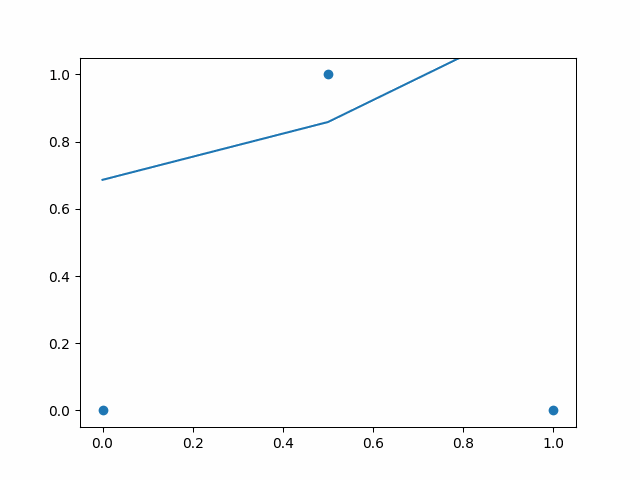
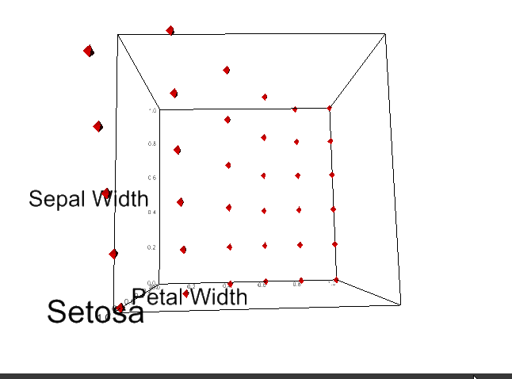

# Deep Learning Foundation

---

This is the smallest toy example of neural network fitting squiggle to data and finding optimal values for its parameters. In real world there will be large no of data points and squiggle will be very complex and there will be large no of parameters to be learned.
Animation of Backpropagation and learning of parameters of the Neural Networks that fits squiggle to the data 🎉🔥.

## Multiple input and output(class) Neural Networks

Neural network tries to fit squiggle to all class of the dataset. Here three class and it's squiggle fit by NN is shown.

|                                                  Setosa                                                   |                                                     Versicolor                                                      |                                                    Virginica                                                    |
| :-------------------------------------------------------------------------------------------------------: | :-----------------------------------------------------------------------------------------------------------------: | :-------------------------------------------------------------------------------------------------------------: |
|  Setosa value is close to 1 when Petal width is close to 0 |  Versicolor value is close to 1 when Petal width is close to 0.4 |  Virginica value is close to 1 when Petal width is close to 1 |
